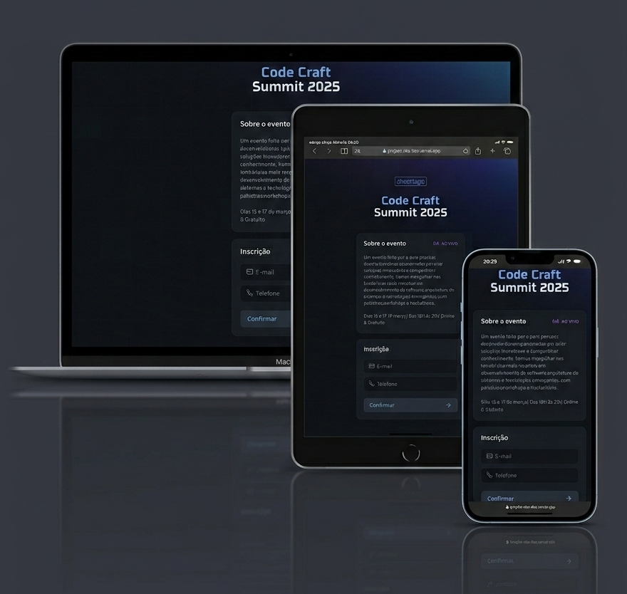

# :page_with_curl: Página de Inscrições

<p>Projeto desenvolvido durante o curso NLW Connect FullStack, com foco em HTML, CSS e JavaScript.</p>

<h2>📖 Sobre o projeto</h2>

<p>Este projeto consiste em uma página de inscrições para um curso online, onde o usuário deve preencher um formulário para garantir sua vaga.
<p>Além do cadastro tradicional, o sistema implementa uma funcionalidade de indicação de amigos:</p>
<ul>
  <li>Após concluir sua inscrição, o usuário recebe um link personalizado.</li>
  <li>Esse link pode ser compartilhado com outras pessoas que ainda não estão participando.</li>
  <li>Cada novo cadastro realizado por meio do link gera uma pontuação para o usuário que indicou.</li>
  <li>O participante com mais indicações ganha prêmios exclusivos.</li>
</ul>

<p>Pensando na responsividade, o site foi desenvolvido para se adaptar a diversos tamanhos de tela, permitindo acesso via computador, tablet ou smartphone.</p>

🔗 Deploy: https://projeto-nlw-lilac.vercel.app/

📁 Repositório: https://github.com/MarianaASoares/projeto-nlw

---

# :rocket: Tecnologias

  

---

# :camera: Preview

 

🔗 [Ver projeto](https://projeto-nlw-lilac.vercel.app/) 

--- 

# :gear: Funcionalidades
<p>✔️ Cadastro de novos usuários via formulário;</p>
<p>✔️ Geração de link personalizado após a inscrição;</p>
<p>✔️Contagem de indicações para cada participante;</p>
<p>✔️ Layout responsivo.</p>

---

# :file_folder: Como executar localmente

```bash
git clone https://github.com/MarianaASoares/projeto-nlw.git

cd projeto-nlw

```

<p>Depois, basta abrir o index.html no navegador.</p>


